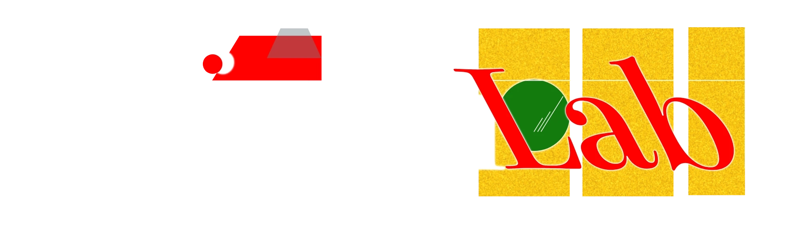
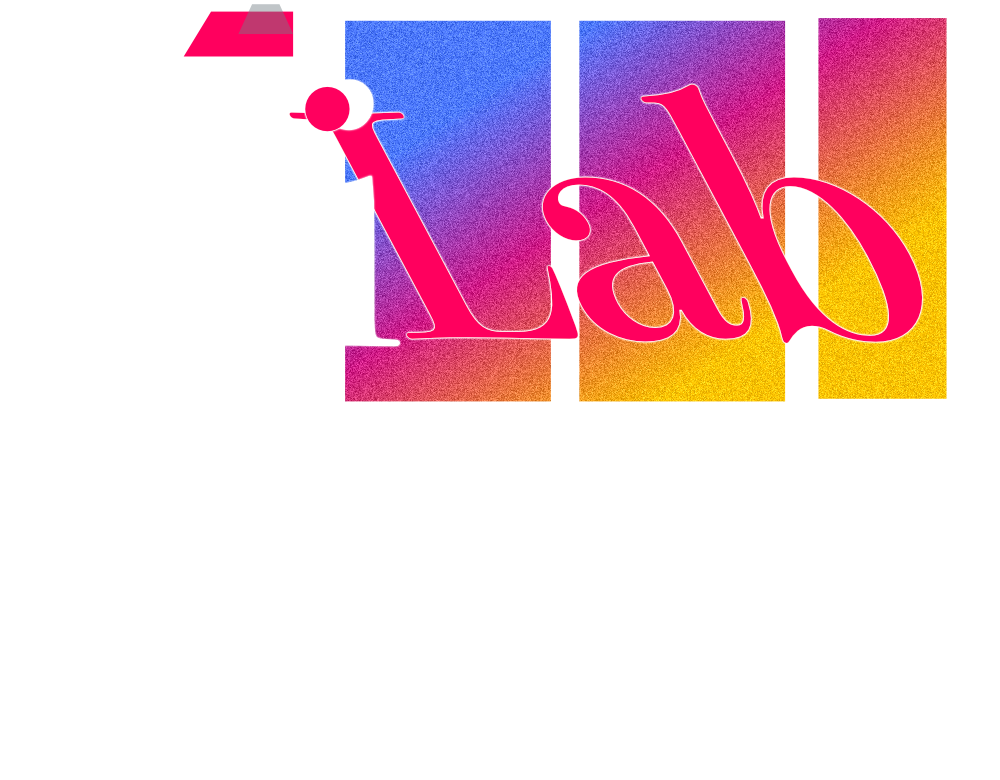

<!-- Logo: Upload to HiramLab/.github/assets/ and update src -->

<p align="center">
  
</p>

<h3 align="center">Code, Content & Learning in Public &middot; Local AI &middot; Full-Stack Infra &middot; Open Source</h3>

<p align="center">
  <a href="https://hiramlab.center"></a>
  <a href="https://hiram.work"></a>
  <a href="https://github.com/hiramAcevedo"></a>
  <a href="https://linkedin.com/company/hiramlab"></a>
</p>

---

**HiramLab** is a public sandbox by [Hiram Acevedo](https://hiram.work) for building projects and sharing tech knowledge. Code, content, and learning in public.

Every project here started as a real need — learning Mandarin, distilling messy files into LLM-ready Markdown, capturing long screenshots, controlling a Mac with gestures. No toy demos; everything ships.

---

### Projects

| Project | What it does | Stack |
|---------|-------------|-------|
| **[HanziFlow](https://github.com/HiramLab/HanziFlow)** | 6-tool ecosystem for Mandarin learning: character writer, conversation engine, OCR, ASR, TTS, vocabulary ETL (11,545 entries). All AI runs locally on 16GB RAM. | Next.js, FastAPI, PaddleOCR v5, mlx-whisper, Ollama, Kokoro TTS, SQLite |
| **[ContextDistill](https://github.com/hiramAcevedo/context-distill)** | CLI that converts DOCX/PDF/HTML/URLs into LLM-optimized Markdown. Pipeline architecture with protocol-based extensibility and OCR support. | Python 3.12, Pandoc, BeautifulSoup, trafilatura |
| **[Precision Scroll Capture](https://github.com/hiramAcevedo/precision-scroll-capture)** | Chrome extension for automated long-page screenshot stitching. Select an area, auto-scroll, get a full composite image. | JavaScript, Chrome APIs (Manifest V3), Service Workers, Canvas API |
| **[GestureCommander](https://github.com/hiramAcevedo/GestureCommander)** | Native macOS app for system-wide trackpad gesture control. Multi-touch recognition via private frameworks, LaunchAgent auto-start. | Swift, SPM, MultitouchSupport.framework, Accessibility APIs |

See also: [Endopolis](https://endopolis.vercel.app) (medical scheduling, 200+ patients, 80% time reduction).

#### Platform Infrastructure

| Project | What it does | Stack |
|---------|-------------|-------|
| **[hiram.work](https://hiram.work)** | Professional CV & portfolio — animated SVG monogram, downloadable CV, contact forms | Next.js 16, React 19, TypeScript, Tailwind CSS 4, Framer Motion, next-intl |
| **[hiramlab.center](https://hiramlab.center)** | Lab showcase — MDX project sheets, generative Canvas backgrounds (5 layers), blueprint grid | Next.js 16, React 19, TypeScript, MDX, Canvas API, SVG animation |
| **Email Infrastructure** | Custom email on own domains with full authentication | Porkbun DNS, Purelymail MTA, SPF/DKIM/DMARC |

Both sites feature full EN/ES internationalization, light/dark theming via CSS design tokens, and react-hook-form + zod contact forms with Resend email and Upstash rate limiting.

---

### Tech Stack

```
Frontend    Next.js 16 · React 19 · TypeScript · Tailwind CSS 4 · Framer Motion · Vue 3
Backend     Python 3.12 · FastAPI · Java 17 · Spring Boot 3 · Node.js · PHP/Laravel
AI/ML       Ollama · mlx-whisper · PaddleOCR v5 · Kokoro TTS · Silero VAD · MCP Servers
Databases   PostgreSQL · MySQL · SQLite · MongoDB · Supabase (RLS) · Prisma
DevOps      Git · GitHub Actions · Docker · Vercel · Railway · DNS (SPF/DKIM/DMARC)
Design      Affinity Designer · Brand Systems · SVG Animation · Canvas API · Typography
```

---

### Philosophy

> *The values that guide every project in the lab.*

**Experiment** — Every project starts as a *"what if?"* Build fast, test assumptions, and iterate until the idea clicks.

**Learn in Public** — Share the process, not just the result. Open-source code, write-ups, and honest post-mortems.

**Build to Understand** — The best way to learn a technology is to ship something real with it. No tutorials — real problems.

**Delight in Details** — Smooth animations, clean APIs, readable code. Craft matters at every layer of the stack.

---

### Technical Approach

> *How we build things here.*

**Local-First AI** — All AI inference (LLMs, ASR, OCR, TTS) runs on-device. No cloud dependency, no data leaving your machine.

**Systems, Not Pages** — Design tokens, brand architecture, modular components. Every project is a system that scales — not a one-off prototype.

**Craft at Every Layer** — From animated SVGs and generative canvas backgrounds to clean database schemas and typed API contracts. Quality isn't a phase — it's the default.

---

<p align="center">
  <a href="https://hiramlab.center">hiramlab.center</a> &middot; <a href="https://hiram.work">hiram.work</a> &middot; <a href="https://github.com/hiramAcevedo">github.com/hiramAcevedo</a>
</p>

<p align="center">
  
</p>
